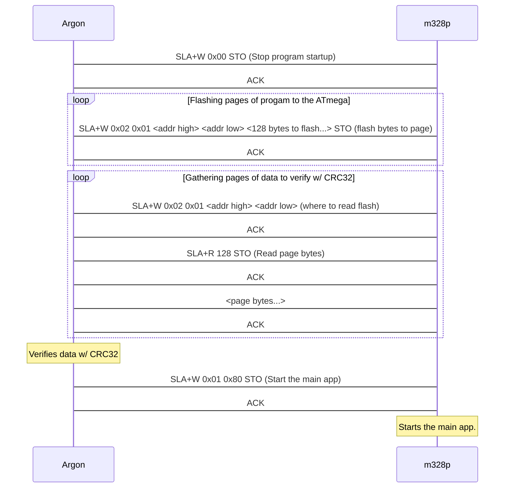

Twiboot is a Particle library that allows for interfacing with the Twiboot bootloader.
It's a simple library that allows for the flashing of a new firmware to a Twiboot-enabled device.
This library was created specifically for the Loop Tracks project.

Example diagram of how an interaction between a Particle Argon and an ATmega chip w/ twiboot would go:

## Installation:

Make sure that your MCU of choice has twiboot installed. A makefile is included here, however, this is mainly for my own purposes (for custom-building twiboot) and is not recommended for use outside of the loop-tracks project. It is recommended to use the makefile in the twiboot subfolder (it's a gitmodule of twiboot).
